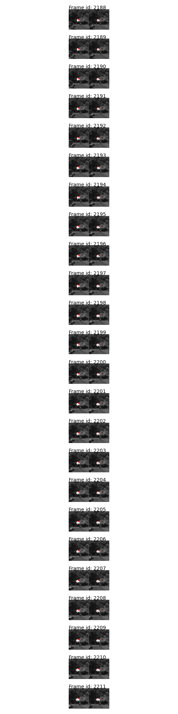
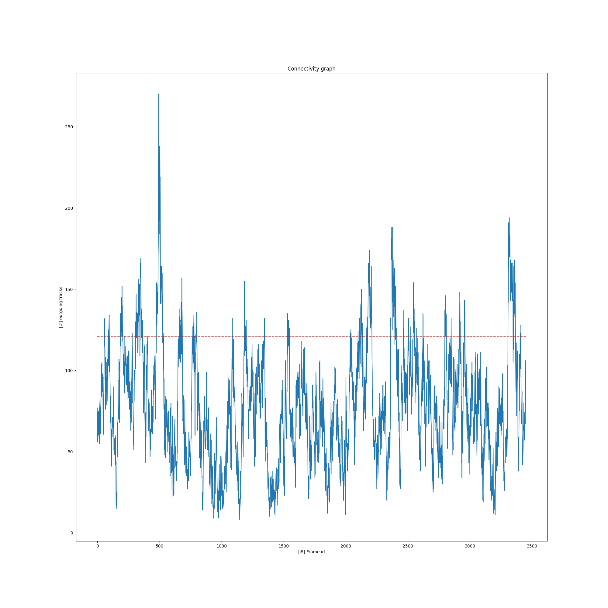
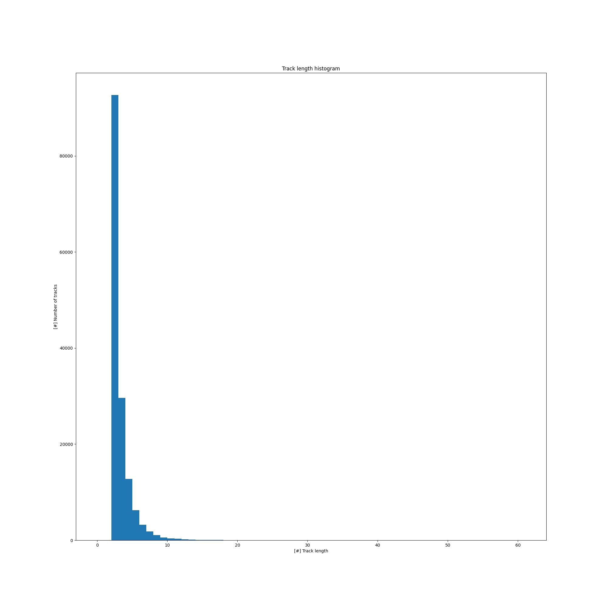

# EX4

## 4.2
- Total number of tracks: 149303
- Total number of frames: 3450
- Average track length: 2 
- Mean number of frame links: 121

## 4.3
A track of length >= 10. Display the feature locations on all relevant images inside patches of 100x100:

## 4.4
Frame links: Number of tracks in frame that are linked to the next frame:

## 4.6
Track length histogram:

