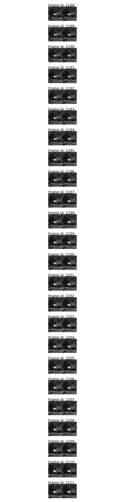
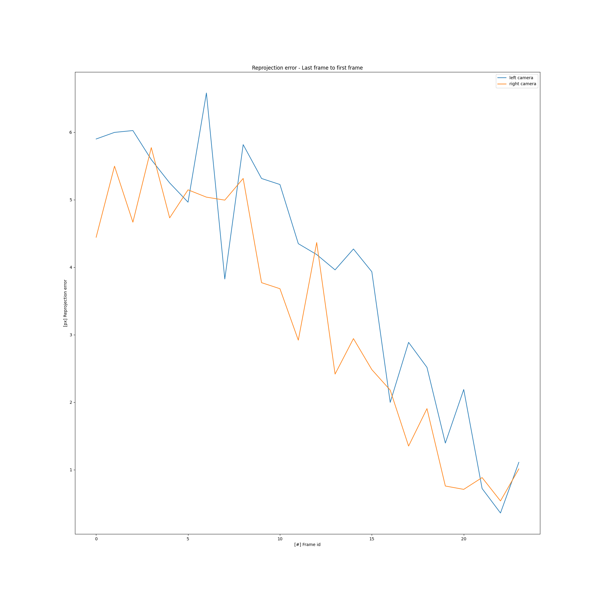
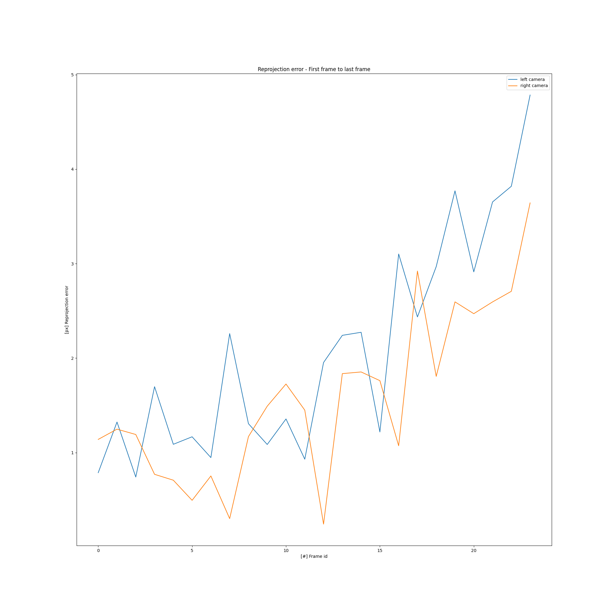

# EX4

## 4.2
- Total number of tracks: 149303
- Total number of frames: 3450
- Average track length: 2 
- Mean number of frame links: 121

## 4.3
A track of length >= 10. Display the feature locations on all relevant images inside patches of 100x100:

## 4.4
Frame links: Number of tracks in frame that are linked to the next frame:

## 4.6
Track length histogram:

## 4.7
Track reprojection error:

Taking the last frame with the track, the 3D coordinate is calculated using the ground truth poses. 
Given the projection matrices $P, Q$, and a point $X$, we know for pixels $p, q$: 

$$ 
\lambda_1{p} = P X \\
\lambda_2{q} = Q X
$$

So that the holds:

$$

\left(\begin{array}{cc} 
P_3p_x - P_1 \\
P_3p_y - P_2 \\
Q_3q_x - Q_1 \\
Q_3q_y - Q_2 \\
\end{array}\right)
X = 0
$$

Solving this with $SVD$ will give the result of the triangulation of the track feature in the last frame.

Here are the images with the same track from above. The original track is shown in red, the reprojected track in cyan:

Here is the reprojection error for the left and right cameras:

As clearly seen, the reprojection error decreases towards the last frame (where the 3D world coordinates were calculated from the ground truth poses). This is due to minor tracking inaccuracies, which accumalate given there are also measurement in the ground truth poses.

To prove this, the same graph is plotted for the first frame of the track:

